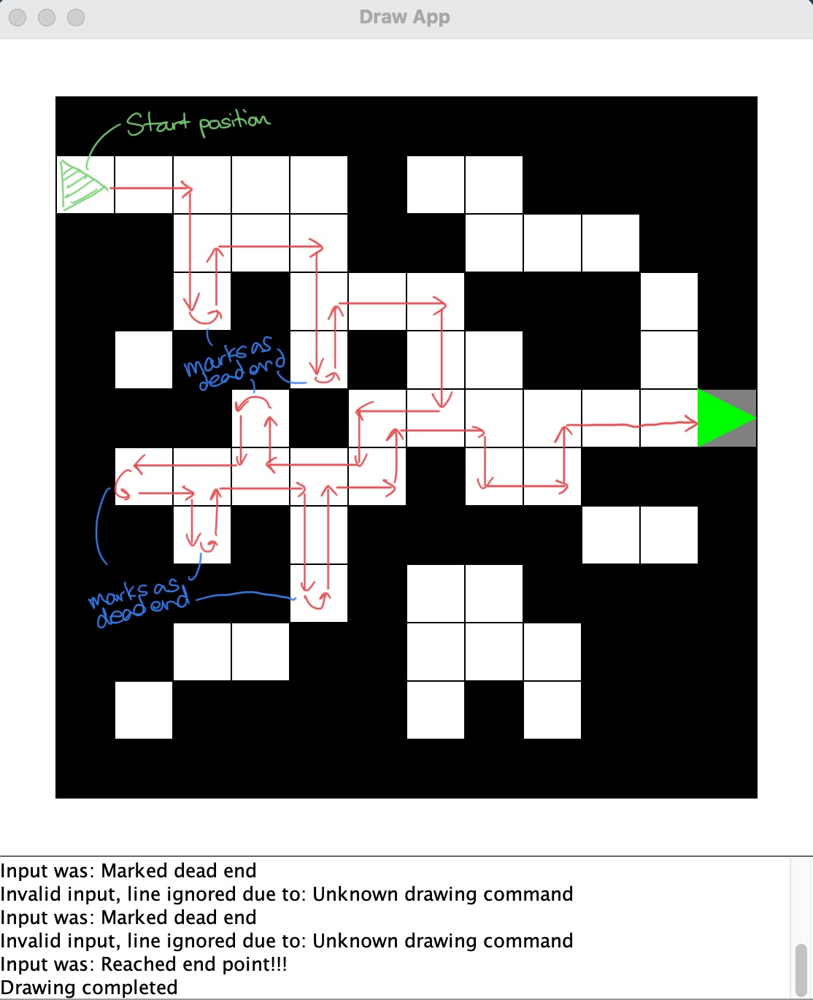
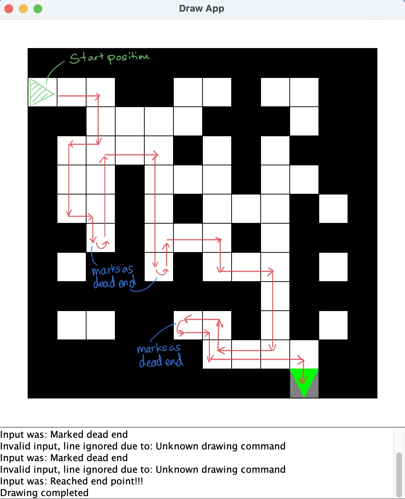

## How the programs works

### 1. Maze algorithm

To construct the maze, the program uses a 2d array where 0 is the path the robot can take, 1 is the wall and 2 is the finish point. This will allow the robot to both track its position as well as displaying the maze.

The maze algorithm uses the stick to the right wall basis. This means that the robot will check every possible path, starting from the rightmost one. Everytime the robot moves, it will turn right to see if there is a possible path. If yes, it will turn right and move forward. If it can't turn right, then it will turn left and check the forward position. If it can move forward, then it will continue moving. If it can't move forward and it will turn left again and check forward position. Basically, it will check all of its direction, starting from the right, to forward, to the left.

If the robot can't move in all directions, it means that it has reached a dead end. The program will mark the current position, which is the dead end, as 1 so that the robot will not move back to that position ever again. This is to help prevent the robot from going in loops if that part of the maze is a dead end. Also, this will allow the robot to recognise the robot has already passed this dead end as it is already marked with 1.

At every position, the robot will also check in all directions to see if the end is in sight, marked as 2 in the grid. If it can move to the end at the next move, it will break out from the loop and finally reaching the end.

Here are two diagram to show how the algorithm works on mazes generated.

  
   

### 2. Maze generator

Firstly, a global 2d array is declared which will form the maze. The generate maze algorithm will create the main path which will create a clear path between the start point and the end.

The x and y values of the starting points are passed in. It will then be randomized whether the marker will move down or right. This will keep repeating until either the market reaches x = 11 or y = 11 which is the edge of the grid. The final market will then be marked as 2 which signifies the end. This ensures that there will always be a valid path between the start and the end.

To make the maze more interesting, 50 random walls will be removed within the grid which will create either dead ends or loops which can trick the robot. This is done through the drawTrap function.

## What each file is and how to run them

### 1. mazeGeneratorPlusAlgo.c
This file contains both the generator and algorithm where a random maze will be generated and the robot will move using the algorithm to the end.

HOW TO RUN?

gcc -o mazeGeneratorPlusAlgo mazeGeneratorPlusAlgo.c graphics.c

./mazeGeneratorPlusAlgo | java -jar drawapp-2.0.jar

### 2. mazeAlgorithm.c
This file contains only the algorithm of the robot.

HOW TO RUN?

gcc -o mazeAlgorithm mazeAlgorithm.c graphics.c

./mazeAlgorithm | java -jar drawapp-2.0.jar

### 3. mazeGenerator.c
This file contains only the maze generator.

HOW TO RUN?

gcc -o mazeGenerator mazeGenerator.c graphics.c

./mazeGenerator | java -jar drawapp-2.0.jar